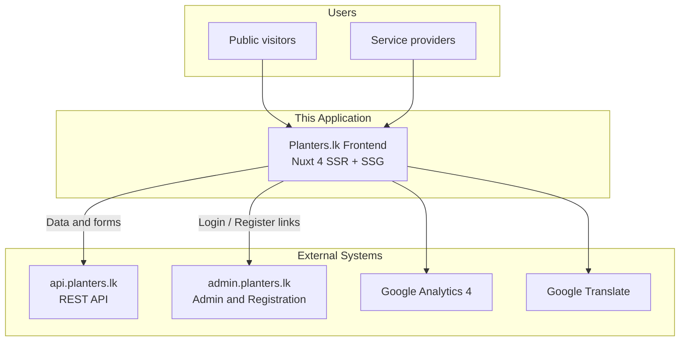
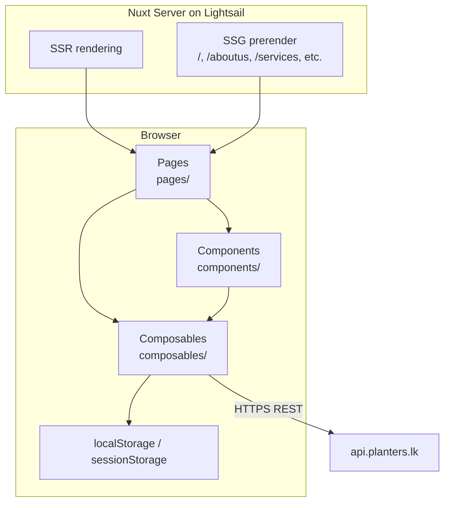
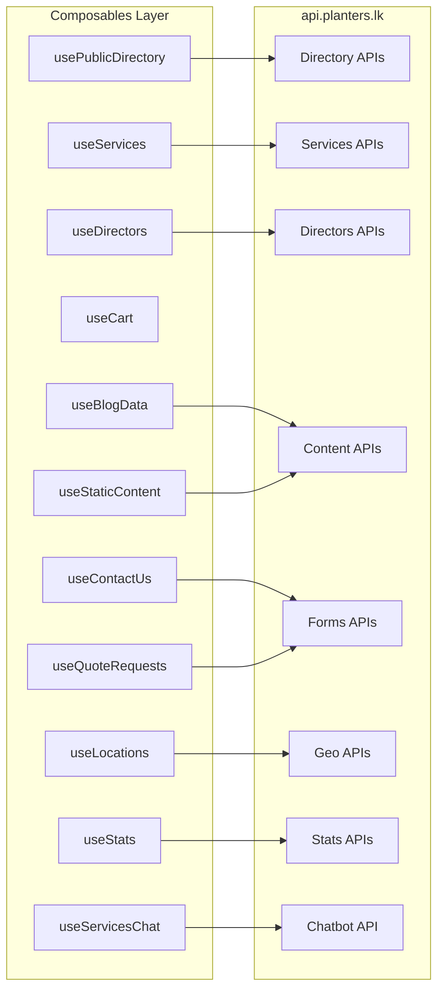
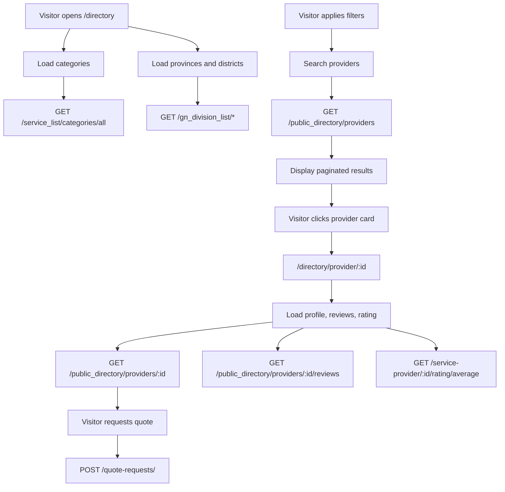
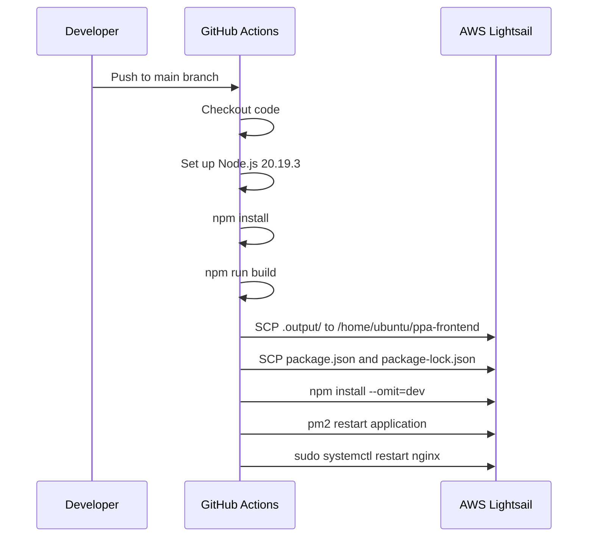
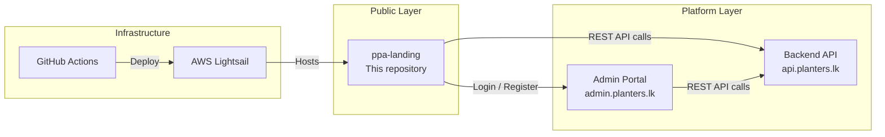

# Planters.lk — System Architecture

**Proprietary Planters Alliance (PPA) Public Web Portal**

| Document version | 1.0 |
|---|---|
| Application | Planters.lk Landing Site |
| Repository | `ppa-landing` |
| Last updated | July 2026 |

---

## Table of Contents

**Part 1 — Executive Summary**
1. [Introduction](#1-introduction)
2. [System Context](#2-system-context)
3. [Core Capabilities](#3-core-capabilities)
4. [Key User Journeys](#4-key-user-journeys)

**Part 2 — Technical Architecture**
5. [Technology Stack](#5-technology-stack)
6. [Application Architecture](#6-application-architecture)
7. [Repository Layout](#7-repository-layout)
8. [External Integrations & API Surface](#8-external-integrations--api-surface)
9. [Key Feature Deep-Dives](#9-key-feature-deep-dives)
10. [Deployment & Operations](#10-deployment--operations)
11. [Configuration](#11-configuration)
12. [Security & Boundaries](#12-security--boundaries)

**Part 3 — Appendix**
13. [Page Route Reference](#13-page-route-reference)
14. [Local Development](#14-local-development)
15. [Related Systems](#15-related-systems)

---

# Part 1 — Executive Summary

## 1. Introduction

The **Planters.lk** web application is the public-facing portal for the **Proprietary Planters Alliance (PPA)** — a platform serving Sri Lanka's plantation sector. It connects planters, investors, service providers, researchers, and policymakers with information, services, and each other.

This repository (`ppa-landing`) contains the **public marketing and service-discovery frontend**. It is a modern web application that presents PPA's offerings, enables visitors to browse and request services, and provides a searchable directory of registered service providers.

### What this application is

- A public website accessible to anyone without login
- A service catalog and request portal for director-led plantation services
- A searchable directory of verified service providers
- A content hub for blogs, announcements, and organizational information

### What this application is not

- An admin or back-office system (handled by `admin.planters.lk`)
- A user authentication system (login and registration redirect to the admin portal)
- A backend API (all data and business logic live in `api.planters.lk`)

### Audience served

| Audience | How they use the platform |
|---|---|
| Planters & estate managers | Browse services, find providers, request quotes |
| Investors | Learn about PPA, view stats and organizational info |
| Service providers | Discover registration paths; appear in the public directory once approved |
| Researchers & policymakers | Access blogs, announcements, and sector information |
| General public | Contact PPA, read about the alliance, explore services |

---

## 2. System Context

The Planters.lk frontend sits at the center of a multi-system architecture. It renders pages for end users and communicates with external services for data, authentication, analytics, and translation.



### System roles

| System | URL | Role |
|---|---|---|
| **This application** | `planters.lk` | Public frontend — marketing, services, directory, content |
| **Backend API** | `api.planters.lk` | REST API — data, forms, content, search, stats |
| **Admin portal** | `admin.planters.lk` | Authentication, provider/service registration, back-office |
| **Google Analytics 4** | — | Page view and engagement tracking |
| **Google Translate** | — | Multilingual UI (English, Sinhala, Tamil) |

---

## 3. Core Capabilities

### Marketing & Information

- **Homepage** with hero section, service highlights, live statistics, and vision/mission content
- **About Us** page with CMS-driven content and promotional video
- **Our Team** page showcasing PPA directors with links to individual profiles
- **Membership** information page

### Services Catalog

- Browse director-led plantation services organized by category
- View detailed service descriptions, pricing, and director information
- Add services to a shopping cart and submit a consolidated request at checkout

### Public Service Provider Directory

- Search and filter providers by category, subcategory, province, and district
- Sort results by relevance, rating, or name
- View provider profiles with qualifications, documents, and public reviews
- Request quotes directly from provider profile pages

### Content

- **Blogs** — list, detail, and comment on articles
- **Announcements** — latest news and updates
- **Static content** — CMS-managed HTML for pages such as About Us and Web Policy

### Engagement

- **Contact form** for general inquiries
- **Feedback and complaints** submission
- **AI chatbot** widget for director matching and service guidance
- **Quote requests** from the provider directory

### Platform Features

- **Multilingual UI** — English, Sinhala (සිංහල), and Tamil (தமிழ்) via Google Translate
- **Light/dark theme** toggle with user preference persistence
- **Responsive design** built with Vuetify 3 for desktop and mobile
- **Analytics** via Google Analytics 4 and custom first-visit tracking

---

## 4. Key User Journeys

### Journey 1: Request a Director-Led Service

1. Visitor browses the **Services** page and explores available offerings
2. Opens a service detail page to read the full description
3. Adds one or more services to the **cart**
4. Proceeds to **Checkout**, fills in contact details
5. Submits the request — data is sent to the backend API
6. PPA directors follow up through their internal processes

### Journey 2: Find and Contact a Service Provider

1. Visitor navigates to the **Directory**
2. Selects a service category and applies location or search filters
3. Browses paginated provider results
4. Opens a provider profile to view qualifications, reviews, and documents
5. Submits a **quote request** via the on-page dialog
6. The provider receives the request through the backend system

### Journey 3: Learn About PPA and Get in Touch

1. Visitor explores the **Homepage**, **About Us**, and **Our Team** pages
2. Reads **Blogs** and **Announcements** for sector news
3. Uses the **Contact Us** page to send an inquiry or feedback
4. Optionally uses the **Chatbot** for guided director matching

### Journey 4: Register as a Provider or Service

1. Visitor clicks **Join PPA** or navigates to the provider selector page
2. Chooses whether to register as a service provider or register a service
3. Is redirected to the **admin portal** (`admin.planters.lk`) for registration
4. After approval, the provider may appear in the public directory

---

# Part 2 — Technical Architecture

## 5. Technology Stack

| Layer | Technology | Version / Notes |
|---|---|---|
| Framework | Nuxt | 4.x |
| UI library | Vue | 3.x |
| Language | TypeScript + JavaScript | Mixed composables |
| Component framework | Vuetify | 3.x |
| Icons | Material Design Icons | `@mdi/font` |
| Styling | SASS + custom fonts | Poppins via Google Fonts CDN |
| Data fetching | `$fetch`, `useAsyncData` | No local API layer |
| Internationalization | `nuxt-google-translate` | en, si, ta |
| Carousels | Swiper, vue-flux | Homepage and announcements |
| Analytics | Google Analytics 4 | `G-XVW7315F4E` |
| Runtime | Node.js | 20.19.3 |
| Process manager | PM2 | Production server |
| Reverse proxy | nginx | Production server |
| Hosting | AWS Lightsail | Deployed via GitHub Actions |
| CI/CD | GitHub Actions | Push-to-deploy on `main` |

### Rendering strategy

The application uses a **hybrid SSR + SSG** approach:

- **Server-Side Rendering (SSR)** is enabled globally for dynamic, data-driven pages
- **Static Site Generation (SSG)** pre-renders high-traffic pages at build time for faster load times

Pre-rendered routes: `/`, `/aboutus`, `/announcements`, `/services`, `/contactus`

All other routes are rendered on demand via SSR.

---

## 6. Application Architecture

### Layered structure



### Architectural decisions

| Decision | Rationale |
|---|---|
| **Thin frontend** | No `server/api` routes in this repo. All business logic, validation, and persistence live in the backend API at `api.planters.lk`. |
| **Composable-based state** | No Pinia or Vuex store. Shared state is managed via Vue composables with module-level reactive refs. |
| **Client-side cart** | Shopping cart items persist in `localStorage` under the key `cartItems`. No server-side session required. |
| **No in-app authentication** | Login, registration, and admin functions are delegated to `admin.planters.lk`. This app has no route guards or auth middleware. |
| **Hybrid rendering** | SSR for dynamic pages; SSG prerender for static marketing pages to optimize performance and SEO. |
| **Direct API calls** | Composables call the backend REST API directly via `$fetch`. There is no Backend-for-Frontend (BFF) proxy layer. |

### Global application shell

The root layout (`app.vue`) wraps every page with:

| Element | Component | Purpose |
|---|---|---|
| Language selector | `GoogleTranslate` | Multilingual widget |
| Navigation | `AppNavBar` | Top navigation, cart button, theme toggle |
| Page content | `NuxtPage` | Routed page component |
| Shopping cart | `CartModal` | Cart review and checkout trigger (client-only) |
| AI assistant | `Chatbot` | Director matching chatbot (client-only) |
| Footer | `AppFooter` | Site footer with links and info |

---

## 7. Repository Layout

```
ppa-landing/
├── app.vue                    # Root layout shell
├── nuxt.config.ts             # Nuxt configuration (SSR, SSG, runtime config)
├── package.json               # Dependencies and scripts
├── tsconfig.json              # TypeScript configuration
│
├── pages/                     # File-based routing (22 pages)
├── components/                # Reusable Vue components
│   ├── cart/                  # Cart button, modal, nav button
│   ├── directory/             # Provider card, quote dialog
│   └── svgmap/                # Sri Lanka map component
│
├── composables/               # API integration and shared state (14 files)
├── plugins/                   # Vuetify, GA4, site-visit tracking
├── types/                     # TypeScript type definitions
├── assets/                    # Bundled assets (CSS, video, images)
├── public/                    # Static files served as-is (images, icons)
│
├── server/                    # Nuxt server config only (no API routes)
└── .github/workflows/         # CI/CD deployment pipeline
    └── deploy.yml
```

### Key directories

| Path | Purpose |
|---|---|
| `pages/` | File-based routes — each `.vue` file maps to a URL |
| `components/` | Reusable UI components (navigation, footer, directory, cart, chatbot, sections) |
| `composables/` | Data fetching, API integration, and shared reactive state |
| `plugins/` | Nuxt plugins for Vuetify theme, GA4 tracking, and site-visit logging |
| `public/` | Static assets served directly (logos, team photos, certifications, icons) |
| `assets/` | Build-time assets (custom fonts, promotional video, chatbot image) |
| `types/` | Shared TypeScript interfaces (e.g., director types) |
| `.github/workflows/` | GitHub Actions CI/CD for automated deployment |

---

## 8. External Integrations & API Surface

All API communication goes through `config.public.backendUrl` (default: `https://api.planters.lk`). Composables act as the integration layer between the UI and the backend.

### Integration overview



### API endpoints by domain

#### Directory

| Method | Endpoint | Composable | Purpose |
|---|---|---|---|
| GET | `/service_list/categories/all` | `usePublicDirectory` | Service categories for filters |
| GET | `/public_directory/providers` | `usePublicDirectory` | Paginated provider search with filters |
| GET | `/public_directory/providers/{id}` | `usePublicDirectory` | Provider profile detail |
| GET | `/public_directory/providers/{id}/reviews` | `usePublicDirectory` | Public reviews for a provider |
| GET | `/service-provider/{id}/rating/average` | `usePublicDirectory` | Average rating for a provider |
| POST | `/quote-requests/` | `useQuoteRequests` | Submit a quote request |

#### Services

| Method | Endpoint | Composable | Purpose |
|---|---|---|---|
| GET | `/service_list/all` | `useServices.js` | Full service catalog (legacy) |
| GET | `/service_list/{id}` | `useServices.js` | Single service detail (legacy) |
| GET | `/service_list/categories/all` | `useServicesChat`, `useDirectors` | Service categories |
| GET | `/service_list/search` | `useServicesChat` | Service search for chatbot |
| GET | `/director_list/admin/all` | `useServices.ts` | Director-managed service listings |
| GET | `/director_list/{id}` | `useServices.ts`, `useDirectorService` | Single director service detail |

#### Directors

| Method | Endpoint | Composable | Purpose |
|---|---|---|---|
| GET | `/directorinfo/user/{userId}` | `useDirectors` | Director profile metadata |
| GET | `/directorinfo/province/{province}` | `useDirectors` | Directors filtered by province |
| GET | `/directorservice/directors` | `useDirectors` | Director contact list |
| GET | `/directorservice/user/{id}` | `useDirectors`, `useDirectorService` | Director's linked services |

#### Content

| Method | Endpoint | Composable / Component | Purpose |
|---|---|---|---|
| GET | `/static_content/{type}` | `useStaticContent` | CMS-managed HTML content |
| GET | `/blog/all` | `useBlogData` | Blog post list |
| GET | `/blog/{id}` | `useBlogData` | Single blog post |
| POST | `/blog/{id}/comments` | `useBlogData` | Submit a blog comment |
| GET | `/announcement/all` | `AnnouncementSection` | Announcements for carousel |

#### Forms & Requests

| Method | Endpoint | Composable / Page | Purpose |
|---|---|---|---|
| POST | `/contact_us/` | `useContactUs` | General contact form |
| POST | `/complaint/` | `contactus.vue` | Feedback and complaints |
| POST | `/service-requests/` | `checkout.vue`, `Chatbot` | Submit service cart request |
| POST | `/directorrequests/` | `checkout.vue` | Submit director service request |

#### Geography

| Method | Endpoint | Composable | Purpose |
|---|---|---|---|
| GET | `/gn_division_list/all_province` | `useLocations` | List of provinces |
| GET | `/gn_division_list/distrct_by_province` | `useLocations` | Districts by province |
| GET | `/gn_division_list/all_district` | `useLocations` | All districts |

#### Statistics

| Method | Endpoint | Composable | Purpose |
|---|---|---|---|
| GET | `/membershipapplication/stats/dashboard` | `useStats` | Membership application counts |
| GET | `/estates/stats/dashboard` | `useStats` | Estate registration stats |
| GET | `/service-provider/stats/dashboard` | `useStats` | Provider application stats |
| GET | `/rc_self_monitor/production_and_cost/stats/dashboard` | `useStats` | Production and cost stats |
| GET | `/site_visits/stats` | `useStats` | Site visit counter |
| GET | `/payment/stats/retainer_clients` | `useStats` | Retainer client count |
| POST | `/site_visits/` | `siteVisit.client.ts` | Log a first-visit event |

#### Chatbot

| Method | Endpoint | Component | Purpose |
|---|---|---|---|
| POST | `/chatbot/match-director` | `Chatbot.vue` | AI-powered director matching |

---

## 9. Key Feature Deep-Dives

### Public Directory

The public directory is the primary way visitors discover and connect with registered service providers.

**Primary page:** `pages/directory/index.vue`

**Data flow:**



**Search parameters:**

| Parameter | Description |
|---|---|
| `q` | Free-text search query |
| `category_id` | Filter by service category |
| `subcategory_id` | Filter by service subcategory |
| `province_code` | Filter by Sri Lankan province |
| `district_code` | Filter by district |
| `sort` | Sort order (relevance, rating, name) |
| `page` | Page number for pagination |
| `page_size` | Results per page |
| `lan` | Language code |

**Supporting components:**

| Component | Role |
|---|---|
| `components/directory/ProviderCard.vue` | Provider summary card with average rating |
| `components/directory/RequestQuoteDialog.vue` | Quote request form dialog |
| `pages/directory/provider/[id].vue` | Full provider profile page |

### Services & Checkout

**Flow:** Services page → Service detail → Add to cart → Checkout → API submission

| Step | File | Action |
|---|---|---|
| Browse services | `pages/services.vue` | Displays director-led service catalog |
| View detail | `pages/service/[id].vue` | Shows full service description |
| Add to cart | `composables/useCart.ts` | Stores item in `localStorage` |
| Review cart | `components/cart/CartModal.vue` | Modal overlay for cart review |
| Checkout | `pages/checkout.vue` | Contact form + submission |
| Submit request | `pages/checkout.vue` | POST to `/service-requests/` and/or `/directorrequests/` |

The cart supports both standard services and director-specific services. Cart state persists across browser sessions via `localStorage`.

### AI Chatbot

The chatbot widget (`components/Chatbot.vue`) is available on every page (client-side only). It:

1. Loads service categories via `useServicesChat`
2. Guides the user through service selection and location
3. Sends a matching request to `POST /chatbot/match-director`
4. Can submit a service request on the user's behalf via `POST /service-requests/`

### Analytics

Two complementary tracking mechanisms are in place:

| Mechanism | Implementation | Data collected |
|---|---|---|
| **Google Analytics 4** | Head script in `nuxt.config.ts` + `plugins/ga4.client.ts` | Page views, route changes, user engagement |
| **Custom site visits** | `plugins/siteVisit.client.ts` | First visit per browser session (UUID + user agent) sent to `POST /site_visits/` |

Homepage statistics (membership counts, estate registrations, provider counts, etc.) are fetched live from multiple dashboard endpoints via `composables/useStats.ts`.

### Multilingual Support

The `nuxt-google-translate` module provides a language selector widget supporting:

| Code | Language |
|---|---|
| `en` | English (default) |
| `si` | Sinhala (සිංහල) |
| `ta` | Tamil (தமிழ்) |

Translation is handled client-side by Google Translate. API requests can include a `lan` parameter for backend-localized content where supported.

---

## 10. Deployment & Operations

### CI/CD pipeline

Deployments are fully automated via GitHub Actions. Every push to the `main` branch triggers a build and deploy.



### Infrastructure

| Component | Details |
|---|---|
| **Hosting** | AWS Lightsail instance |
| **Deploy path** | `/home/ubuntu/ppa-frontend` |
| **Build output** | `.output/` directory (Nitro server bundle + static assets) |
| **Process manager** | PM2 — keeps the Nuxt server running |
| **Reverse proxy** | nginx — terminates SSL and forwards to the Nuxt server |
| **Node.js version** | 20.19.3 (managed via nvm on the server) |

### Required GitHub secrets

| Secret | Purpose |
|---|---|
| `LIGHTSAIL_HOST` | Server IP or hostname |
| `LIGHTSAIL_USER` | SSH username (e.g., `ubuntu`) |
| `LIGHTSAIL_SSH_KEY` | Private SSH key for deployment |

### Build commands

| Command | Purpose |
|---|---|
| `npm install` | Install dependencies |
| `npm run build` | Production build (SSR + SSG) → outputs to `.output/` |
| `npm run dev` | Local development server on port 3000 |
| `npm run preview` | Preview production build locally |
| `npm run generate` | Full static site generation |

---

## 11. Configuration

All runtime configuration is defined in `nuxt.config.ts` under `runtimeConfig.public`. These values are accessible in composables and components via `useRuntimeConfig()`.

| Key | Default value | Usage |
|---|---|---|
| `backendUrl` | `https://api.planters.lk` | Base URL for all REST API calls |
| `adminAppUrl` | `https://admin.planters.lk` | Admin portal link (Login button) |
| `registerUrl` | `https://admin.planters.lk/register` | Provider registration link |
| `registerServiceUrl` | `https://admin.planters.lk/registerservice` | Service registration link |
| `ga4Id` | `G-XVW7315F4E` | Google Analytics 4 measurement ID |

### Environment variable overrides

Although no `.env` file is committed to the repository, Nuxt supports overriding public config via environment variables at build or runtime:

```
NUXT_PUBLIC_BACKEND_URL=https://api.planters.lk
NUXT_PUBLIC_ADMIN_APP_URL=https://admin.planters.lk
NUXT_PUBLIC_REGISTER_URL=https://admin.planters.lk/register
NUXT_PUBLIC_REGISTER_SERVICE_URL=https://admin.planters.lk/registerservice
NUXT_PUBLIC_GA4_ID=G-XVW7315F4E
```

### Client-side persistence

| Key | Storage | Purpose |
|---|---|---|
| `cartItems` | `localStorage` | Shopping cart contents |
| `theme` | `localStorage` | Light/dark theme preference |
| `ppa_visited` | `sessionStorage` | First-visit tracking flag |

---

## 12. Security & Boundaries

### Access model

- **All pages are public.** There is no authentication, authorization, or route middleware in this application.
- **No sensitive data is stored** in this frontend. User credentials, provider data, and business records live exclusively in the backend API and admin portal.

### Security boundaries

| Concern | Handling |
|---|---|
| Authentication | Delegated to `admin.planters.lk` — no login logic in this app |
| Registration | Redirected to admin portal registration URLs |
| Form submissions | Sent directly to `api.planters.lk` over HTTPS |
| Cart data | Stored client-side in `localStorage` only — no PII persisted server-side |
| API keys / secrets | None stored in this frontend; all config values are public |
| CORS | Backend API must allow requests from the frontend origin |

### Data flow security

```
Browser  ──HTTPS──▶  nginx (Lightsail)  ──▶  Nuxt SSR Server  ──HTTPS──▶  api.planters.lk
```

All communication between the browser and backend occurs over HTTPS. The frontend does not implement its own API proxy — composables call the backend directly from both server-side (SSR) and client-side contexts.

---

# Part 3 — Appendix

## 13. Page Route Reference

| Route | File | Description | Rendering |
|---|---|---|---|
| `/` | `pages/index.vue` | Homepage — hero, services, stats, vision | SSG |
| `/aboutus` | `pages/aboutus.vue` | About PPA with CMS content and video | SSG |
| `/services` | `pages/services.vue` | Director-led service catalog | SSG |
| `/service/:id` | `pages/service/[id].vue` | Service detail with add-to-cart | SSR |
| `/directory` | `pages/directory/index.vue` | Public provider directory with search | SSR |
| `/directory/provider/:id` | `pages/directory/provider/[id].vue` | Provider profile, reviews, quote | SSR |
| `/service-providers` | `pages/service-providers.vue` | Alternate directory view | SSR |
| `/director/:id` | `pages/director/[id].vue` | Director profile page | SSR |
| `/director-services/:id` | `pages/director-services/[id].vue` | Director-specific service detail | SSR |
| `/ourteam` | `pages/ourteam.vue` | PPA team and director cards | SSR |
| `/checkout` | `pages/checkout.vue` | Cart checkout and request submission | SSR |
| `/contactus` | `pages/contactus.vue` | Contact form and feedback | SSG |
| `/blogs` | `pages/blogs/index.vue` | Blog post listing | SSR |
| `/blogs/:id` | `pages/blogs/[id].vue` | Blog post detail with comments | SSR |
| `/announcements` | `pages/announcements.vue` | Announcements page | SSG |
| `/membership` | `pages/membership.vue` | Membership information | SSR |
| `/providerselector` | `pages/providerselector.vue` | Choose registration path | SSR |
| `/registerprovider` | `pages/registerprovider.vue` | Provider registration wrapper | SSR |
| `/web-policy` | `pages/web-policy.vue` | Website policy (static content) | SSR |
| `/signin` | `pages/signin.vue` | Sign-in placeholder | SSR |
| `/signup` | `pages/signup.vue` | Sign-up placeholder | SSR |
| `/test` | `pages/test.vue` | Development test page | SSR |

---

## 14. Local Development

### Prerequisites

- Node.js 20.19.3 (recommended, matches production)
- npm

### Setup

```bash
# Clone the repository
git clone <repository-url>
cd ppa-landing

# Install dependencies
npm install

# Start development server
npm run dev
```

The development server starts at `http://localhost:3000`.

### Available scripts

| Script | Command | Description |
|---|---|---|
| Development | `npm run dev` | Start dev server with hot reload |
| Build | `npm run build` | Production build to `.output/` |
| Preview | `npm run preview` | Serve the production build locally |
| Generate | `npm run generate` | Full static site generation |

### Backend connectivity

By default, the application connects to the production API at `https://api.planters.lk`. To use a local backend during development:

1. Set the environment variable: `NUXT_PUBLIC_BACKEND_URL=http://localhost:8000`
2. Some composables (e.g., `useDirectors.ts`) also include a `localhost:8000` fallback when `backendUrl` is not configured

### Adding SSG routes

To pre-render additional pages at build time, add routes to the `nitro.prerender.routes` array in `nuxt.config.ts`:

```typescript
nitro: {
  prerender: {
    routes: ["/", "/aboutus", "/announcements", "/services", "/contactus"],
  },
},
```

---

## 15. Related Systems

This repository is one part of the broader Planters.lk platform. The following systems are **out of scope** for this repository but are essential to the platform's operation.

| System | URL | Repository | Role |
|---|---|---|---|
| **Backend API** | `api.planters.lk` | Separate repo | REST API — all data, business logic, form processing, search, content management |
| **Admin Portal** | `admin.planters.lk` | Separate repo | User authentication, provider/service registration, back-office management, approvals |

### Platform ecosystem



### Division of responsibilities

| Responsibility | This app | Backend API | Admin portal |
|---|---|---|---|
| Public marketing pages | Yes | — | — |
| Service catalog display | Yes | Provides data | Manages services |
| Provider directory | Yes | Provides data | Manages providers |
| Cart & checkout UI | Yes | Processes requests | — |
| User authentication | — | Validates tokens | Handles login |
| Provider registration | Redirect only | Stores data | Registration forms |
| Content management | Displays content | Serves content | CMS interface |
| Analytics tracking | Collects events | Stores visit data | Dashboard views |
| Blog & announcements | Displays content | Serves content | Content editor |

---

*This document describes the architecture of the Planters.lk public frontend as of July 2026. For questions about the backend API or admin portal, refer to their respective documentation.*
